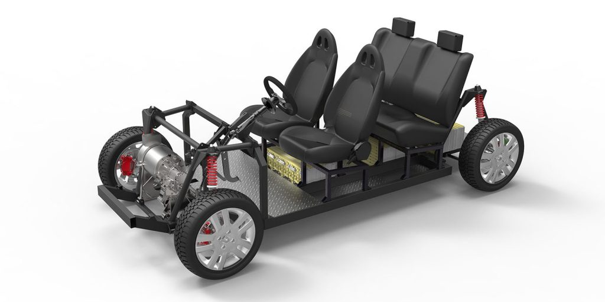

# Viridi

This readme provides an overview of our tech startup, plans for the future, and our ethical & cultural standards that we uphold.

---

## Business Plan

### Long-Term Vision Statement
Our goals include:
- Becoming a key figure and competitor in pioneering the next era of automotives with clean energy and incorporated "next step" features such as self driving AI
- Releasing cost effective products to our consumers to make eco friendly cars more affordable and mainstream
- Helping achieve a lower carbon footprint wherever our business and endeavors take us

Our inspiration stems from:
- A need to push forward innovation in the automotive industry for a faster transition into eco friendly vehicles
- The fact that cars with eco friendly aspects and/or new self driving technologies are still a luxury item that we want to normalize
- Other companies that were the first step towards creating a solution for the betterment of the planet and our ecosystems

Questions we consider:
- How can we normalize eco friendly car as a viable option for drivers?
- How can we decrease our carbon footprint to its fullest?
- What new machine learning advances are essential for a safer road?

### External Opportunities
The world is beginning to prioritize solutions for climate change. With the executive order by California Gov. Gavin Newsom (D) to only allow gas-emission car sales until 2035, we see an opportunity to compete in the rapidly growing industry that is electric cars. To expedite our company’s R&D, we plan to integrate open source frameworks from the likes of Tesla, AWS, and many more. With the high demand from both the consumer market and government along with the foundations that others have already set, we see an opportunity to rush to market with a viable product and create our identity from the early stages of this rapidly growing market.

### Team Bio

### Strategy
General Strategy:
Our strategy revolves around taking notes from the top trends in the electric car industry, refining our products to be as eco-efficient as possible, and delivering a cost-effective car to the common consumer.

OKR (milestones):
-The team has set their milestones high by working towards an increase in sales by 20% annually
improvements to battery time by 15% annually. 
Within 5 years, our team’s central goal is to be the largest distributor of electrical cars in the U.S.
Within 5 years, we want to reduce our carbon footprint for our manufacturing pipeline by 20%.

Differentiate from other Companies:
-Our unique approach to the market is in mass-production and low costing electrical cars.

Case Study of Competitor:
-Being based in Silicon Valley, our greatest competitor is Tesla. From Tesla’s history, it is evident that their company is continually achieving higher efficiency in battery life, software, and innovation. By taking some of the frameworks from Tesla’s open-source projects, we hope to refine it and find our place in the market.

### Slogan
***"The driving force in achieving ststainable energy"***

--- 
 
## Cultural Policy

### How do you want to be thought of?
Viridi Automotives wants to be thought of as a pioneering force pushing for the change and innovation that lead to a more eco friendly driving experience. We what to be the answer to the question "What can the future look like for the normal driver?"

### What are the core values of the company?
Our core values are a greener and safer life for all our customers. We strive for a car that is affordable because we believe being a part of the push for green energy should not be a luxury. Our motivations are focused on being a part of improving the driving experience with our eco friendly vehicles, and with our smart cars at a lesser price than other competitors. We want self driving components and extra safety precautions added to our cars for safer roads for every family.

### Motivation
As a company, we all share a great passion for developing and innovating bleeding-edge technologies. We believe that modern issues such as climate change can be confronted and resolved with modern solutions. Even our governments are beginning to recognize this threat such as how California's Governor Newsom has announced that the state would phase out gas cars by 2035. With the rising threat and awareness of climate change, we see an oppurtunity to be part of the solution. We understand and fear that our time for complacency is no more and we must take a proactive commitment so that our future generations can continue to enjoy the earth that we see today.

### In summary
We strive for
- Innovation
- Excellence
- Environmental Friendliness
- Wide Accessibility

---

## Ethics Policy

### Core Items
*Become the Solution*
We prioritize the idea that all our costs and procedures must not contribute to the problem of emissions. This means: 
- The materials we use are to be ethically sourced
- We will avoid cutting corners to make profit at the expense of low emission efficiency
-  Our investors and those we invest in take the message of a greener road to practice not just through their investments, but through their own businesses and endeavors

*Remember Who We Serve*
- We are striving to create a cost friendly alternative that allows for an easy driving experience without the downsides of traditional gas cars
- The people we serve are not just wealthy individuals, but low income individuals who want to be a part of the change we will bring
- We do not tailor our vehicles away from the people with less money, but towards them

*Understand the Power of AI*
AI can be the leading concept for making our streets safer, but can be problem in the roads if implemented poorly.
- We will never implement an algorithm that we do not view as functionally 100% in terms of safety
- Our self learning systems are monitored and updated to ensure every year we become safer

*Respect the Privacy of our Consumers*
We understand the amount of trust that comes with implementing self learning into an every day use vehicle.
- We will never conceal what information is gathered from our consumer
- Driving habits, location, and other information will be opt in only. This information is specifically for understanding the average driver and seeing what may need to change in our vehicles as the road culture changes as well

*Easy Customer Service and Repair*
- Our parts and vehicles can be serviced by most mechanics
- Extra precautions will be in place, but we will not become a barrier in allowing for a cheaper, local alternative to any issue the vehicle is experiencing

*Nonnegotiables*
- In becoming a leading force in the industry, we will not disregard any of the aforementioned policies
- Our information will have public accessibility. Transparency will take priority in all of our decisions
- Monetary gain will not become a priority over our service to the people

### Board
Martin Eberhard
- As one of the original cofounders of Tesla, his input will prove invaluable in navigating the space of eco friendly vehicles. Eberhard's work with Tesla and Volkswagen demonstrates an ability to contribute in guiding the direction of our company towards our goals.

Ram Pendyala
- Pendyala is a researcher in transportation systems engineering, design, modeling and simulation, travel behavior analysis, multimodal transport policy analysis, freight and passenger travel demand forecasting, travel survey methods and transportation economics and finance. With such a vast resume of research and information in the changing world of transportation, we hope working with Pendyala will lead to confidence in our vehicles

Dmitri A. Dolgov
- Dolgov's work with Waymo, an industry changing company in the field of autonomous vehicles, will be able to provide insight on self driving vehicle safety. Furthermore, his input allows for the opportunity to learn from another established company in hopes of creating something new and affordable, but equal efficiency in its eco friendly technologies.

---

## Experimentation & Priorities

Our strategy revolves around taking open-source frameworks from companies like Tesla or OSVehicle in order to quickly bootstrap ourselves in developing mass-producible zero-emission vehicles. 

For creating our first prototype, we will look to OSVehicle Tabby for our hardware frame to start from. From OSVehicle Tabby, the basic chassis and hardware systems will cost us $12,000. From there, we will add the necessary components to make it a more "complete car". For testing and experimentation, we will look for potential customers to “take it for a spin,” so that we can find the balancing point between comfort and cost. We are going to experiment in finding ways to reduce the price while adding in user-friendly software. The OKR’s or metrics for us to gauge our progress will be how much the car would cost and the user-satisfaction reviews. We intend for this prototype to be a way for our group to assess how well we can push the concept of a super entry-level EV car. 

Our intial priorities will be to test out the prototypes and frameworks that we pull to see what works and what need further tuning. For example, the overal battery life and general efficiency will be our first component to go under thorough and numerous testing.

---
